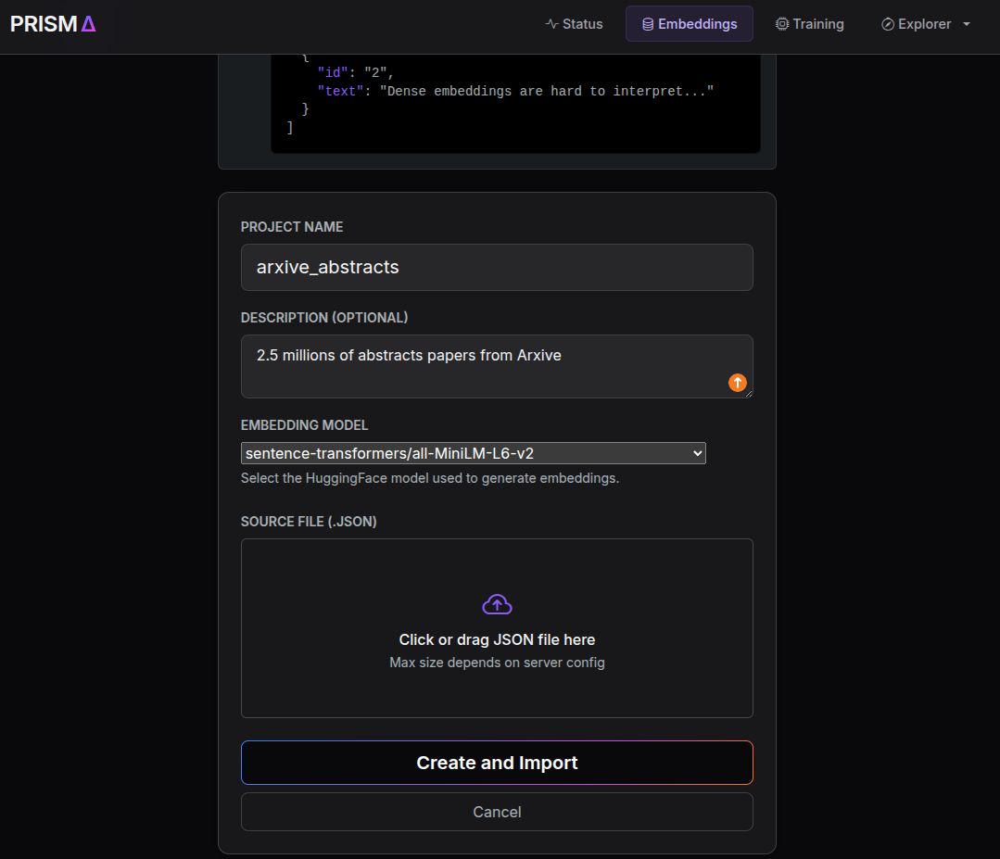
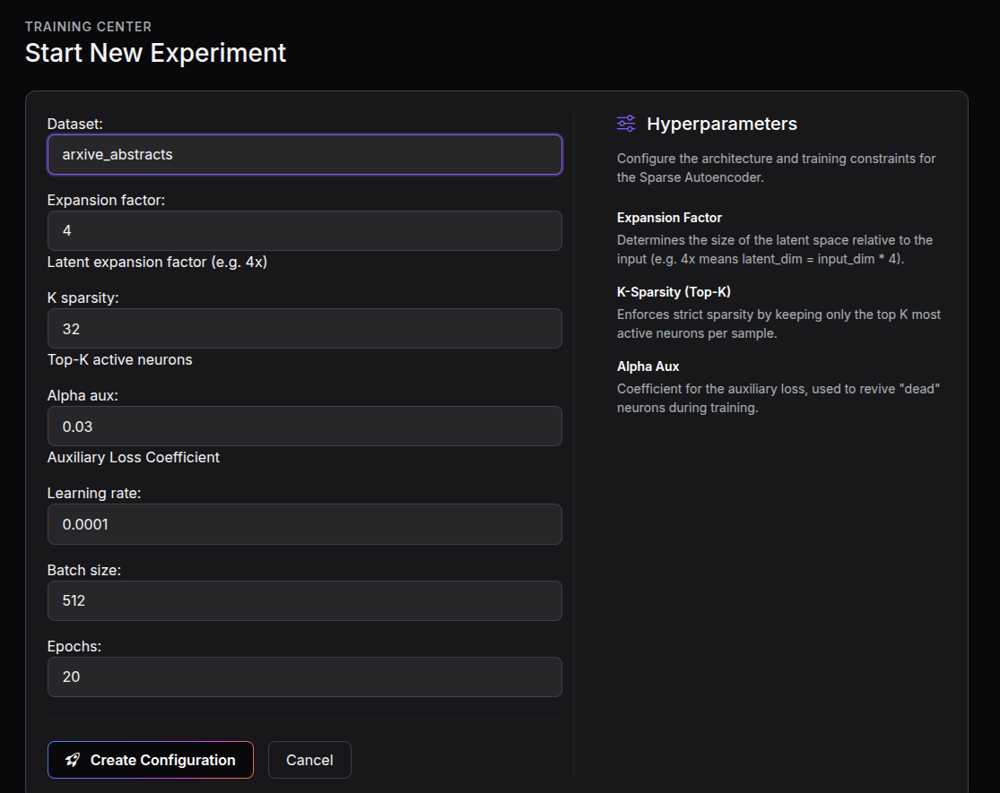
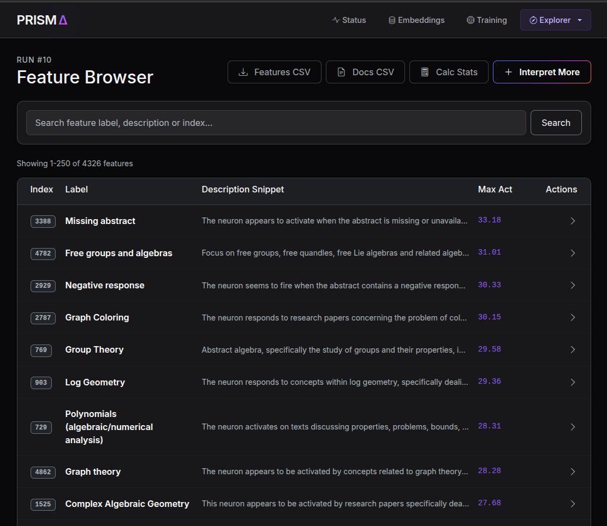
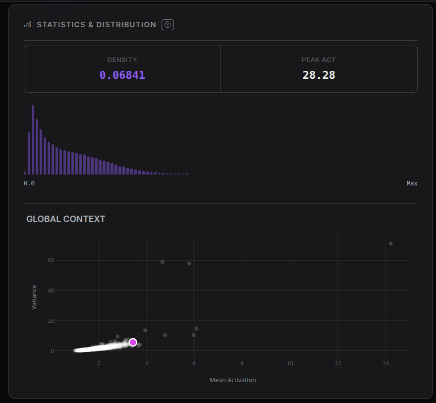
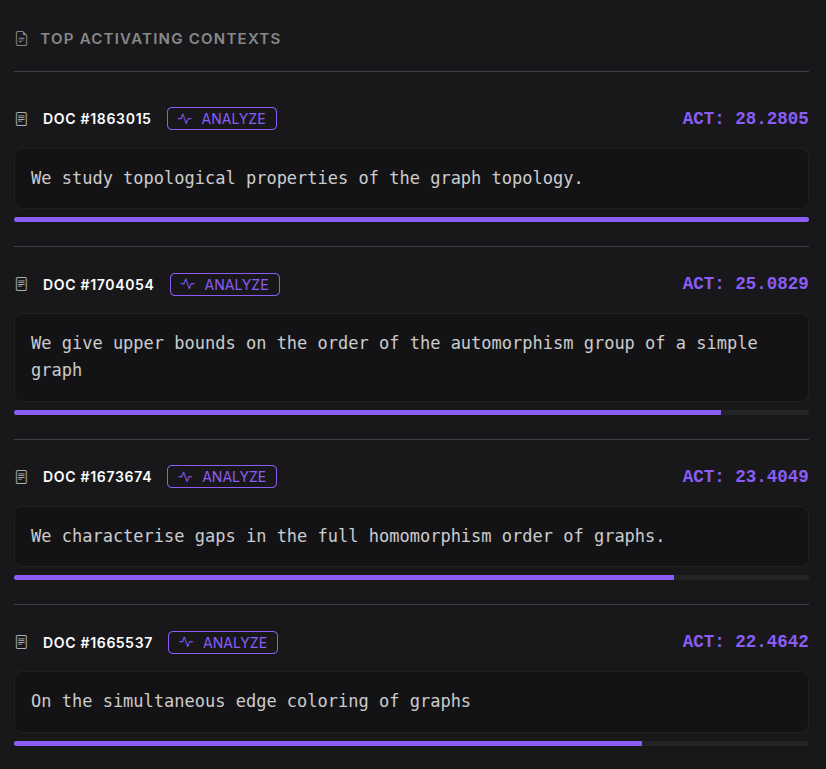
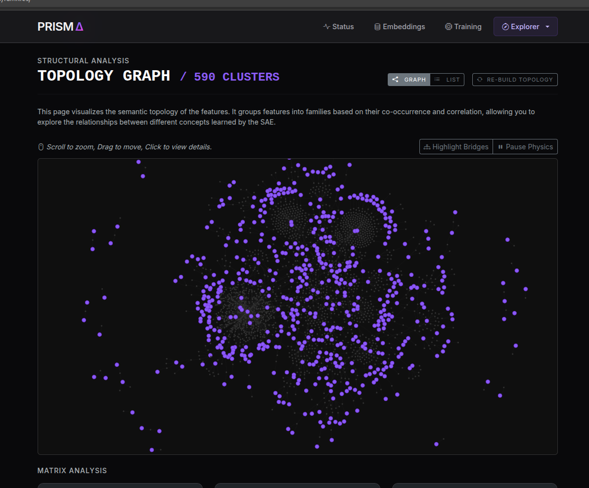

# PRISMA

**Projection of Representations for Interpretability via Sparse Monosemantic Autoencoders**

PRISMA is a Django web application that makes Large Language Model (LLM) embeddings interpretable. Like an optical prism decomposes white light into its spectral components, PRISMA decomposes dense embedding vectors into sparse, human-readable **monosemantic features** using Sparse Autoencoders (SAEs).

Built as part of a thesis project by **Edoardo Tedesco**.

<p align="center">
  
</p>

---

## The Problem

LLMs project text into high-dimensional dense embeddings where individual dimensions have no intrinsic meaning. Neurons are **polysemantic** -- a single neuron may respond to multiple unrelated concepts. This is explained by the **Superposition Hypothesis** (Elhage et al. 2022): networks compress more concepts than they have neurons by exploiting statistical independence between features.

PRISMA reverses this process through **disentanglement**: projecting dense embeddings into an overcomplete, sparse latent space where each axis corresponds to an interpretable atomic concept.

## How It Works

```
Dense Embedding x (d dims)
        |
   [ Encoder ]
        |
Sparse Latent h (n dims, n >> d)     <-- Top-K sparsity: only k neurons active
        |
   [ Decoder ]
        |
Reconstruction x_hat ~ x
```

1. **Embed** -- Upload a text dataset and compute embeddings with HuggingFace models (medBIT, GTE, MiniLM, ...)
2. **Train SAE** -- Train a Sparse Autoencoder with Top-K hard sparsity on the embeddings
3. **Interpret** -- An LLM (via Ollama) labels each latent feature by examining its highest-activating documents
4. **Explore** -- Browse features, view activation statistics, co-occurrence graphs, and a knowledge graph built from feature relationships

### Effective Rank Analysis

PRISMA includes an analysis based on the **Effective Rank** (Roy & Vetterli 2007) of the sparse activation matrix. By comparing the effective rank on real data vs. a null hypothesis (random inputs), the **Semantic Compression Ratio** quantifies how much real semantics constrains the latent space -- demonstrating that extracted concepts are not independent but form structured co-activation patterns.

---

## Architecture

The application is organized into three Django apps:

| App | Purpose |
|---|---|
| `embeddings` | Dataset upload, HuggingFace embedding computation, PCA/clustering analysis |
| `sae` | SAE model definition (Top-K), training loop, sparsity heatmaps |
| `explorer` | Feature interpretation (via Ollama), statistics, co-occurrence analysis, knowledge graph |

### Key Modules

- `sae/modules.py` -- SAE architecture with Top-K sparsity and auxiliary dead-neuron loss
- `sae/trainer.py` -- Training pipeline with z-score normalization and heatmap generation
- `embeddings/embedders.py` -- HuggingFace model wrappers with chunked encoding
- `explorer/interpreter.py` -- Automated feature interpretation using local LLMs
- `explorer/graph_builder.py` -- Knowledge graph construction via Maximum Spanning Tree
- `explorer/statistics.py` -- Feature correlation, co-occurrence, and histogram computation

---

## Setup

### Prerequisites

- Python 3.10+
- [Ollama](https://ollama.ai) (for feature interpretation)

### Installation

```bash
git clone https://github.com/<your-username>/PRISMA.git
cd PRISMA

python -m venv venv
source venv/bin/activate  # On Windows: venv\Scripts\activate

pip install -r requirements.txt
```

### Configuration

Create a `.env` file or export environment variables:

```bash
export DJANGO_SECRET_KEY='your-secret-key-here'
export DJANGO_DEBUG=True
export DJANGO_ALLOWED_HOSTS='127.0.0.1,localhost'
```

### Database

```bash
python manage.py migrate
python manage.py createsuperuser  # optional
```

### Run

```bash
# Start Ollama (in a separate terminal)
ollama serve

# Start Django
python manage.py runserver
```

Visit `http://127.0.0.1:8000/`.

### Sample Dataset

A ready-to-use sample of 1000 PubMed abstracts is included at `sample_data/pubmed_abstracts_1000.json` (source: [suolyer/pile_pubmed-abstracts](https://huggingface.co/datasets/suolyer/pile_pubmed-abstracts)). Upload it directly from the Embeddings page to get started.

---

## Usage

### 1. Upload a dataset

Provide a JSON file with text documents and select a HuggingFace embedding model.

<p align="center">
  
</p>

### 2. Train a Sparse Autoencoder

Configure expansion factor, Top-K sparsity, and other hyperparameters.

<p align="center">
  
</p>

### 3. Browse interpreted features

The LLM interpreter labels each latent feature automatically. Browse all discovered concepts with their activation statistics.

<p align="center">
  
</p>

### 4. Inspect individual features

View activation histograms, density, and global context for each feature.

<p align="center">
  
  <br>
  
</p>

### 5. Explore the knowledge graph

Visualize the semantic topology of extracted features -- a directed graph built from co-occurrence and correlation analysis via Maximum Spanning Tree.

<p align="center">
  
</p>

---

## Supported Embedding Models

| Key | Model |
|---|---|
| `medbit` | IVN-RIN/medBIT |
| `gte_multilingual` | Alibaba-NLP/gte-multilingual-base |
| `sbert_minilm` | sentence-transformers/all-MiniLM-L6-v2 |
| `sbert_mpnet` | sentence-transformers/all-mpnet-base-v2 |
| ... | and more (see `embeddings/models.py`) |

---

## References

- O'Neill, C. et al. (2024). *Disentangling Dense Embeddings with Sparse Autoencoders*. arXiv:2408.00657
- Elhage, N. et al. (2022). *Toy Models of Superposition*. Transformer Circuits Thread
- Roy, O. & Vetterli, M. (2007). *The Effective Rank: A Measure of Effective Dimensionality*. EUSIPCO
- Wang, X. et al. (2024). *Disentangled Representation Learning*. arXiv:2211.11695

## License

This project is released for academic and research purposes.
